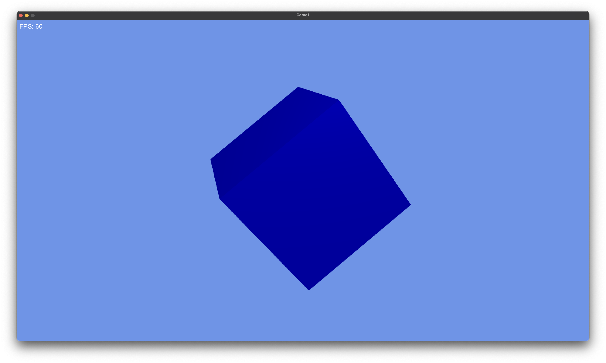

# Game1 - 3D Model Viewer

A 3D model viewer built with MonoGame that displays a cube model with interactive controls.

## Features

- **3D Model Rendering**: Displays a 3D cube model with proper lighting and perspective
- **Interactive Controls**: Rotate the model using WASD keys
- **Full-Screen Support**: Toggle full-screen mode with the F key
- **Performance Monitoring**: Real-time FPS counter display
- **High-Quality Graphics**: Multi-sampling and HiDef graphics profile for smooth visuals

## Controls

- **WASD**: Rotate the 3D model
- **F**: Toggle full-screen mode
- **Escape**: Exit the application

## Requirements

- .NET 8.0
- MonoGame Framework 3.8

## Getting Started

1. Clone or download this repository
2. Open `Game1.sln` in Visual Studio or your preferred IDE
3. **Important**: Build the content using the MonoGame Content Pipeline Tool:
   - Open the MonoGame Content Pipeline Tool
   - Load the `Content/Content.mgcb` file
   - Build all content assets (models, fonts, etc.)
4. Build and run the project
   - `dotnet build`
   - `dotnet run`

The application will open displaying a 3D cube model that you can rotate using the WASD keys.

## Project Structure

- `Game/Game1.cs` - Main game logic and rendering
- `Program.cs` - Application entry point
- `Content/` - Game assets including models and fonts
  - `Models/ship.fbx` - 3D cube model
  - `Font.spritefont` - Font for UI text
- `Game1.csproj` - Project configuration

## Technical Details

- **Resolution**: 1920x1080 (configurable)
- **Graphics Profile**: HiDef with multi-sampling
- **Camera**: Fixed perspective camera positioned at (0, 2, 6)
- **Lighting**: Default BasicEffect lighting system

## Screenshot

> 3D cube model rendered with MonoGame
